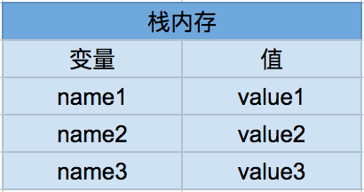
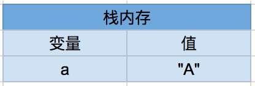
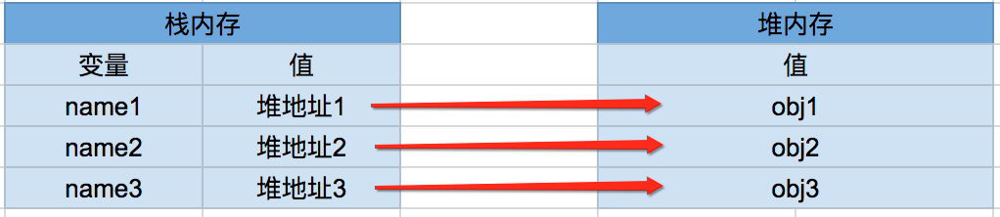
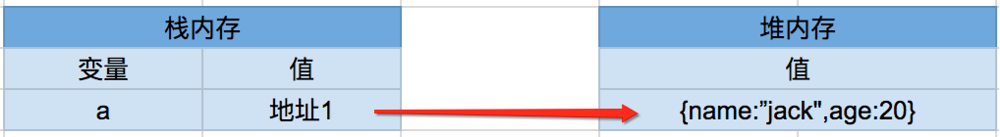
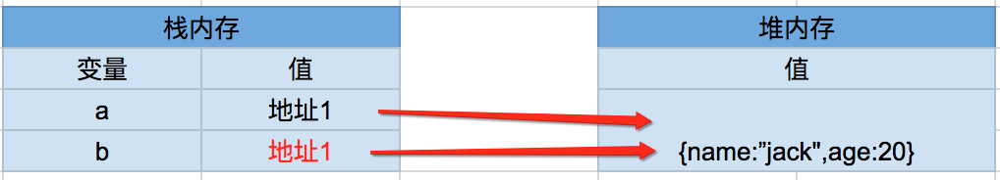
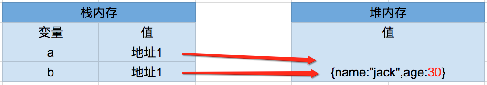

**基本数据类型** 保存在 栈内存,形式如下：栈内存中分别存储着变量的标识符以及变量的值。



var a = "A";

在栈内存中是这样的



**引用类型** 保存在堆内存中,栈内存存储的是变量的标识符以及对象在堆内存中的存储地址，当需要访问引用类型（如对象，数组等）的值时，首先从栈中获得该对象的地址指针，然后再从对应的堆内存中取得所需的数据。



var a = {name:“jack”};

```jsx
  var a= {name:"jack",age:20};
  var b= a;
  console.log(a=== b);
  a.age= 30;
  console.log(a);//{ name: 'jack', age: 30 }
  console.log(b);//{ name: 'jack', age: 30 }
  //改变 a 变量的值，会影响 b 的值。
```

内存中是这样的：

var a = {name:"jack",age:20};



var b = a;



a.age = 30;



**深浅拷贝** 
的主要区别就是：复制的是引用(地址)还是复制的是实例。

深拷贝就是在堆内存中开辟一个新的值，一个全新的地址对应一个全新的值