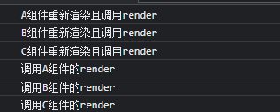
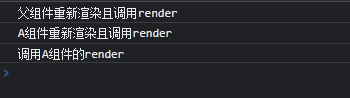
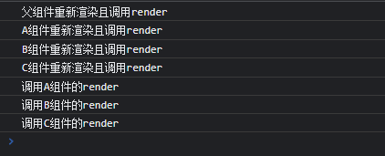
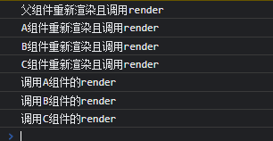
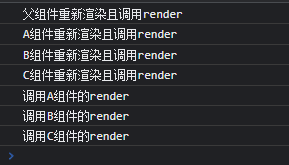
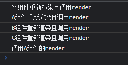

## hooks中父子组件的传值

父传子

```jsx
//父组件
export default function App() {
  const [data, setdata] = React.useState(0)

  function addclick() {
    setdata(data + 1)
  }
  return (
    <div>
      <h1>子传父{num}</h1>
      <button onClick={addclick}>父按钮</button>
      <List data = {data} ></List>
    </div>
  )
}
```

```jsx
//子组件
export default function List (props)  {
  const { data } = props;
	console.log(data)//父传子的数据
  return <div>
    <h1>父传子{data}</h1>
  </div>;
}
```

子传父:

```jsx
//父组件
export default function App() {
  const [num, setnum] = React.useState(0)//先定义一个暂存数据
  
  return (
    <div>
      <h1>子传父{num}</h1>
      <List setshowregisterdata= { setnum }></List>
    </div>
  )
}
```

```jsx
//子组件
export default function List (props)  {
  const { setshowregisterdata} = props;//自定义方法

  const [num, setnum] = React.useState(0)

  function childadd() {
    return () => {
      setnum(num + 1)
      setshowregisterdata(num)
    }
    
  }
  return <div>
    <button onClick={childadd()}>子按钮</button>
  </div>;
}

```


## useState

-  State Hook让函数组件也可以有state状态, 并进行状态数据的读写操作
-  语法: const [xxx, setXxx] = React.useState(initValue)
-  useState()说明:
        参数: 第一次初始化指定的值在内部作缓存
        返回值: 包含2个元素的数组, 第1个为内部当前状态值, 第2个为更新状态值的函数
-  setXxx()2种写法:
        setXxx(newValue): 参数为非函数值, 直接指定新的状态值, 内部用其覆盖原来的状态值
        setXxx(value => newValue): 参数为函数, 接收原本的状态值, 返回新的状态值, 内部用其覆盖原来的状态值
-  更改数组的写法
		tabledata[1].state=! tabledata[1].state
		console.log(tabledata)
		settabledata([...tabledata])

若要获取最新值可以使用useEffect()监听状态

```jsx
//React.useState()
export default function App() {
  const [data, setdata] = useState(0)
  const add= () => {
    setdata(item => item + 1)
    console.log(data);//获取状态上一次的值
  }
  useEffect(() => {
    console.log(data);//获取状态最新值
  }, [data])
  return (
    <div>
      <h3>当前状态:{data}</h3>
      <button onClick={add}>按钮</button>
    </div>
  )
}
```

## useEffect
- Effect Hook 可以让你在函数组件中执行副作用操作(用于模拟类组件中的生命周期钩子)
- React中的副作用操作:
        发ajax请求数据获取
        设置订阅 / 启动定时器
        手动更改真实DOM
- 语法和说明:
```jsx
   useEffect(() => {
     // 在此可以执行任何带副作用操作
     return () => { // 在组件卸载前执行
       // 在此做一些收尾工作, 比如清除定时器/取消订阅等
     }
   }, [stateValue]) // 如果指定的是[], 回调函数只会在第一次render()后执行
```

- 可以把 useEffect Hook 看做如下三个函数的组合

      - componentDidMount()

      - componentDidUpdate()

      - componentWillUnmount()
- Effect中的第二个参数只能监听具有变更效益的状态

```jsx
function App() {
  const [count, setCount] = React.useState(0)
		//React.useEffect()的第二个参数若不写,会监听所有的状态,相当于componentDidMount()与render()
		//若传入一个空数组,不会监听所有对象,相当于componentDidMount()
		//若把一个状态传入一个数组,那会监听改状态的变更,从而做出回调相当于vue中的watch()
		//若返回一个函数,返回函数体内相当于react中的componentWillUnmount()组件卸载  
 React.useEffect(() => {
    console.log(1)
    let time= setTimeout(() => {
        setCount(count=>count+1)
    }, 1000)
    return () => {
      clearTimeout(time)
    }
  }, [count])
  
  return (
     <Fragment> 
      <h1>当前求和:{ count}</h1>
       <button onClick={add}> +1</button>
       <button onClick={del}> 卸载</button>
     </Fragment>
  )
}
```
- useEffect不能监听不具有更新方法的状态
```jsx
function App() {
  let num = 0
  const numset = () => {
    num = num + 1
    console.log(num);
  }
  React.useEffect(() => {
    console.log(111)//不会触发组件调用
  },[num])//只能监听具有更改方法的状态

  return (
    <div className='divbox2'>
       <h2>{num}</h2>
       <Button type="link" onClick={numset}>更改num</Button>
    </div>
  )
}
```


## useRef (createRef)

useRef 返回一个可变的 ref 对象，其 .current 属性被初始化为传入的参数（initialValue）。
返回的 ref 对象在组件的整个生命周期内保持不变
- Ref Hook可以在函数组件中存储/查找组件内的标签或任意其它数据
- 语法: const refContainer = useRef()
- 作用:保存标签对象,功能与React.createRef()一样

```jsx
function App() {
  const useref = React.useRef(null)
  function show() {
    console.log(useref.current.value)//input输入值
  }
  return (
     <> 
      <input type="text" ref={useref} />
      <button onClick={show}>展示</button>
     </>
  )
}
```
- useRef与createRef的区别

```jsx
//例1
import React, { createRef, useRef } from 'react'

export default function App() {
  const inputRef = createRef(1)
  console.log(inputRef)//null

  const useInputRef = useRef(2)
  console.log(useInputRef)//{current: 2}

  const btninputRef = () => {
    console.log(inputRef.current.value)//输入框当前值
  }

  const btnuseInputRef = () => {
    console.log(useInputRef.current.value)//输入框当前值
  }
  return (
    <div>
      {/* null */}
      value: {inputRef.current}
      <input type="text" ref={inputRef} />
      <button onClick={btninputRef}>获取焦点</button>
      <br />
      {/* useRef初始值 */}
      value: {useInputRef.current}
      <input type="text" ref={useInputRef} />
      <button onClick={btnuseInputRef}>获取焦点</button>
    </div>
  )
}
```

```jsx
//例2
import React, { useState, useEffect, createRef, useRef } from 'react'

export default function App() {
  const [num, setNum] = useState(0)
  const uRef = useRef()
  const cRef = createRef()

  const btnClk = () => {
    setNum((num) => num + 1)//使useState的值加1
  }

  useEffect(() => {
    uRef.current.value = num//赋值状态
    cRef.current.value = num//赋值状态
    console.log('in effect')
  }, [num])//监听num变化
  console.log(uRef.current?.value)//过去的状态值
  console.log(cRef.current?.value)//undefined
  return (
    <div className="App">
      <input ref={uRef} />
      <input ref={cRef} />
      <button onClick={btnClk}>button</button>
    </div>
  );
}
//每次点击都会执行useRef和createRef,重新执行useRef()返回的对象是旧的，而重新执行createRef()返回一个新的对象
```

总结:

1.createRef每次重新渲染的时候都会创建一个新的ref对象

2.useRef第一次渲染创建一个对象之后,再重新渲染的时候,如果发现这个对象已经创建过就不会再创建第二次，性能会好一些

3.尽量在class组件中使用createRef，在hooks中使用useRef

## useMemo 和 useCallback 

- 两者区别
useMemo 和 useCallback 接收的参数都是一样,第一个参数为回调 第二个参数为要依赖的数据

共同作用：

1.仅仅 依赖数据 发生变化, 才会重新计算结果，也就是起到缓存的作用。

两者区别：
```
  1.useMemo 计算结果是 return 回来的值, 主要用于 缓存计算结果的值 ，应用场景如:需要 计算的状态

  2.useCallback 计算结果是 函数, 主要用于 缓存函数，应用场景如: 需要缓存的函数，
    因为函数式组件每次任何一个 state 的变化整个组件都会被重新刷新，一些函数是没有必要被重新刷新的，
    此时就应该缓存起来，提高性能，和减少资源浪费。

  注意： 不要滥用会造成性能浪费，react中减少render就能提高性能，所以这个仅仅只针对缓存能减少重复渲染时使用和缓存计算结果。
```
- usememo

避免调用其他子组件的挂在时的render

```jsx
import React from 'react'
export default function Header() {
  let [nameA, setNameA] = React.useState('A')
  let [nameB, setNameB] = React.useState('B')
  let [nameC, setNameC] = React.useState('C')

  /* 不使用useCallback */
  const changeNameFunA = () => {
    setNameA("AAAA")
  }
  const changeNameFunB = () => {
    setNameB("BBBB")
  }
  const changeNameFunC = () => {
    setNameC("CCCC")
  }
  const comA = React.useMemo(() => <A name={nameA} FunA={changeNameFunA} />, [nameA])
  const comB = React.useMemo(() => <B name={nameB} FunB={changeNameFunB} />, [nameB])
  const comC = React.useMemo(() => <C name={nameC} FunC={changeNameFunC} />, [nameC])

  return (
    <>
      {comA}
      {comB}
      {comC}
      {/* <A name={nameA} FunA={changeNameFunA}></A> */}
      {/* <B name={nameB} FunB={changeNameFunB}></B> */}
      {/* <C name={nameC} FunC={changeNameFunC}></C> */}
    </>
  )
}

const A = (props) => {
  console.log("A组件重新渲染且调用render")
  const { FunA, name } = props
  React.useEffect(() => {
    console.log('调用A组件的render')
  }, [FunA])
  return (
    <>
      <h1>A组件：{name}</h1>
      <button onClick={FunA}>改变A</button>
    </>
  )
}

const B = (props) => {
  console.log("B组件重新渲染且调用render")
  const { FunB, name } = props
  React.useEffect(() => {
    console.log('调用B组件的render')
  }, [FunB])
  return (
    <>
      <h1>B组件：{name}</h1>
      <button onClick={FunB}>改变B</button>
    </>
  )
}

const C = (props) => {
  console.log("C组件重新渲染且调用render")
  const { FunC, name } = props
  React.useEffect(() => {
    console.log('调用C组件的render')
  }, [FunC])
  return (
    <>
      <h1>C组件：{name}</h1>
      <button onClick={FunC}>改变C</button>
    </>
  )
}
```

初始状态



使用usememo后点击改变,调用改状态所在的组件render



不使用usememo后点击改变,调用所有与父组件有关的组件的render



- uescallback

避免其他子组件不必要的更新时render调用

```jsx
import React from 'react'
export default function Header() {
  console.log("父组件重新渲染且调用render")
  let [nameA, setNameA] = React.useState('A')
  let [nameB, setNameB] = React.useState('B')
  let [nameC, setNameC] = React.useState('C')
  /* 使用useCallback ==============*/
  const changeNameFunA = React.useCallback(() => {
    setNameA("AAAA")
  }, [nameA])
  const changeNameFunB = React.useCallback(() => {
    setNameB("BBBB")
  }, [nameB])
  const changeNameFunC = React.useCallback(() => {
    setNameC("CCCC")
  }, [nameC])

  /* 不使用useCallback =============*/
  // const changeNameFunA = () => {
  //   setNameA("AAAA")
  // }
  // const changeNameFunB = () => {
  //   setNameB("BBBB")
  // }
  // const changeNameFunC = () => {
  //   setNameC("CCCC")
  // }

  return (
    <>
      <A name={nameA} FunA={changeNameFunA}></A>
      <B name={nameB} FunB={changeNameFunB}></B>
      <C name={nameC} FunC={changeNameFunC}></C>
    </>
  )
}

const A = (props) => {
  console.log("A组件重新渲染且调用render")
  const { FunA, name } = props
  React.useEffect(() => {
    console.log('调用A组件的render')
  }, [FunA])
  return (
    <>
      <h1>A组件：{name}</h1>
      <button onClick={FunA}>改变A</button>
    </>
  )
}

const B = (props) => {
  console.log("B组件重新渲染且调用render")
  const { FunB, name } = props
  React.useEffect(() => {
    console.log('调用B组件的render')
  }, [FunB])
  return (
    <>
      <h1>B组件：{name}</h1>
      <button onClick={FunB}>改变B</button>
    </>
  )
}

const C = (props) => {
  console.log("C组件重新渲染且调用render")
  const { FunC, name } = props
  React.useEffect(() => {
    console.log('调用C组件的render')
  }, [FunC])
  return (
    <>
      <h1>C组件：{name}</h1>
      <button onClick={FunC}>改变C</button>
    </>
  )
}
```

初始状态



不使用的情况下每次点击改变会执行所有子组件的更新时的render



使用的情况下每次点击只会执行需要改变状态的组件render,子组件监听该函数



- usememo与uescallback同时使用

原始代码：父组件，三个子组件，且子组件是兄弟关系

```jsx
function Example() {
  console.log("父组件重新渲染")
  let [nameA, setNameA] = React.useState('A')
  let [nameB, setNameB] = React.useState('B')
  let [nameC, setNameC] = React.useState('C')

	//未使用useCallback  
  // const changeNameFunA =() => {
  //   setNameA("AAAA")
  // }
  // const changeNameFunB = () => {
  //   setNameB("BBBB")
  // }
  // const changeNameFunC = () => {
  //   setNameC("CCCC")
  // }

	//使用useCallback
  // useCallback:当子组件更新时，避免执行非必要的，减少render调用
  const changeNameFunA = React.useCallback(() => {
    setNameA("AAAA")
  }, [nameA])
  const changeNameFunB = React.useCallback(() => {
    setNameB("BBBB")
  }, [nameB])
  const changeNameFunC = React.useCallback(() => {
    setNameC("CCCC")
  }, [nameC])

  // useMemo:当某个子组件更新时，避免调用其他子组件的render
  const comA = React.useMemo(() => <A name={nameA} FunA={changeNameFunA}/>, [nameA])
  const comB = React.useMemo(() => <B name={nameB} FunB={changeNameFunB}/>, [nameB])
  const comC = React.useMemo(() => <C name={nameC} FunC={changeNameFunC}/>, [nameC])
  //更改组件
	return (
    <div>
      {comA}
      {comB}
      {comC} 
      {/* <A name={nameA} FunA={changeNameFunA}></A> */}
      {/* <B name={nameB} FunB={changeNameFunB}></B> */}
      {/* <C name={nameC} FunC={changeNameFunC}></C> */}
    </div>
  );
}

const A = (props) => {
  console.log("A组件重新渲染")
  const { FunA, name } = props
  React.useEffect(() => {
    console.log('调用A组件的render')
  },[FunA])
  return (
    <>
      <h1>A组件：{name}</h1>
      <button onClick={FunA}>改变A</button>
    </>
  )
}

const B = (props) => {
  console.log("B组件重新渲染")
  const { FunB, name } = props
  React.useEffect(() => {
    console.log('调用B组件的render')
  },[FunB])
  return (
    <>
      <h1>B组件：{name}</h1>
      <button onClick={FunB}>改变B</button>
    </>
  )
}

const C = (props) => {
  console.log("C组件重新渲染")
  const { FunC, name } = props
  React.useEffect(() => {
    console.log('调用C组件的render')
  },[FunC])
  return (
    <>
      <h1>C组件：{name}</h1>
      <button onClick={FunC}>改变C</button>
    </>
  )
}
```


<!-- ## useContext 与 useReducer -->

## useContext

用于解决多个子组件传值

创建一个Context.js文件,当作载体

```jsx
import React from "react"
const CountContext = React.createContext()
export { CountContext }
```

在App.js中引入Context.js

```jsx
import React from "react";
import {CountContext } from './Context'//数据传递载体
import List from './component/List'//子组件
import Table from './component/Table'//子组件

export default function App() {
  const [count, setnum] =React.useState(0)
  return (
    <div>
      <h1>{count}</h1>
      <button onClick={() => { setnum(count + 1) }}>按钮</button>

      <CountContext.Provider value={ {count, setnum}}>
        <List></List>
        <Table></Table>
      </CountContext.Provider>
		{/* CountContext.Provider传递参数,Provider 接收一个 value 属性,value填入所需要传递的方法或值,在该标签内,所有的子组件都可以获得value所传递的方法或值,且内部的组件都会呗重新渲染 */}
    </div>
  )
}
```

子组件List

```jsx
import React from "react";
import { CountContext} from '../../Context'

export default function List() {
  const {count,setnum} = React.useContext(CountContext);//获取通过父组件传递的载体值
  console.log(count)//与父组件的count值一样
  return (
    <div>
      <h1>{count}</h1>
      <button onClick={()=>{setnum(count+2)}}>+2</button>
		  {/* 也可以使用父组件的方法 */}
    </div>
  )
}
```

与props做对比:context所传递的组件更多,使用 context, 我们可以避免通过中间元素传递 props：

## useReducer

```jsx
//[useState](https://react.docschina.org/docs/hooks-reference.html#usestate)的替代方案,常用于与useContext配合工作
//state:外部当前值
//disppatch:标记动作类型和包含所需要更改的值(type/value)
//reducer:外部操作动作
//initialState:外部对象,定义外部值的状态
//语法格式
const [state, dispatch] = useReducer(reducer, initialState);
```

```jsx
//外部引用的方法====
const reducer = (oldstate, typedata) => {
	//不能直接修改外部状态的值,需要进行复制
  const newdata = { ...oldstate }
  switch (typedata.type) {
    case 'minus':
      newdata.count--
      return newdata
    case 'add':
      newdata.count++
      return newdata
    default:
      return oldstate
  }
}
//外部引用的方法====
//外部引用的状态====
const initState = {
  count: 0
}
//外部引用的状态====
export default function App() {
//将外部状态与方法内置化
  const [state, dispatch] = React.useReducer(reducer, initState);
  return (
    <div>
      <button onClick={() => {
				//定义动作标记和携带的状态,type为必须
        dispatch({
          type: 'minus',
          value:'111'
        })
      }}>-</button>
      {/* 显示当前外部的值 */}
      {state.count}
      <button onClick={() => {
        dispatch({
          type: 'add',
          value:'222'
        })
      }}>+</button>
    </div>
  )
}
```

## useReducer与useContext同时工作

```jsx
/*
  模拟场景,APP组件中有3个子组件,ABC,其中A控制B和C的状态,ABC均为兄弟组件
	附加:(此写法有性能浪费,可使用useMemo进行性能优化)!!!
*/
//定义外部函数方法
const redecer = (pervState, action) => {
  const newadata = { ...pervState }
  switch (action.type) {
    case 'child2add':
      newadata.count1++
      return newadata
    case 'child3add':
      newadata.count2++
      return newadata
    default:
      return pervState
  }
}
//定义外部状态
const initState = {
  count1: 0,
  count2: 0
}

**const Contextstate = React.createContext()**
export default function App() {
	//获取外部状态与方法
  const [state, action] = React.useReducer(redecer, initState)
  return (
    // 通过Contextstate.Provider向所有子组件转递外部定义的方法和状态
    <Contextstate.Provider value={{ state, action }}>
      <div>
        <A></A>
        <B></B>
        <C></C>
      </div>
    </Contextstate.Provider>
  )
}
//定义子组件A
//A组件控制BC组件的状态
const A = () => {
  //通过结构方法,获得父组件用useContext传递的方法action
  const { action } = React.useContext(Contextstate)
  return (
    <div>
      <button onClick={() => {
        //定义动作标记
        action({
          type: 'child2add'
        })
      }}>改变child2的值</button>
      <button onClick={() => {
        action({
          type: 'child3add'
        })
      }} >改变child3的值</button>
    </div>
  )
}

//定义子组件B
const B = () => {
   //获得父组件用useContext传递的状态state
  const { state } = React.useContext(Contextstate)
	//使用useMemo解决性能优化问题!!!减少不必要的reducer
	return React.useMemo(() => {
		console.log('调用B')
	  return (
	    <div>
	      Child2---{state.count1}
	    </div>
	  )
	}, [state.count1])
}

//定义子组件C
const C = () => {
  //同上
  const { state } = React.useContext(Contextstate)
	return React.useMemo(() => {
		console.log('调用C')
	  return (
	    <div>
	      Child3---{state.count2}
	    </div>
	  )
	}, [state.count2])
}
```
